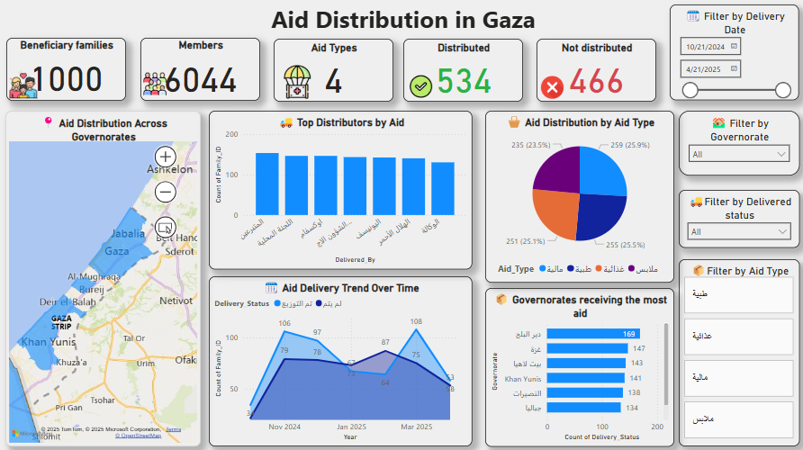

# Gaza Aid Distribution Dashboard



## 📊 Overview
This project presents a **Power BI dashboard** visualizing **simulated data** on the distribution of humanitarian aid in **Gaza**. It was developed to provide clear, data-driven insights into aid delivery efforts, covering:

- Number of beneficiary families and individual members
- Aid types (e.g., food, hygiene, health, winter support)
- Delivered vs. non-delivered aid
- Distribution trends over time
- Top contributors and most supported governorates

The dashboard supports **interactive filtering** by:
- Delivery date
- Governorate
- Aid type
- Delivery status

---

## 🌍 Purpose
This dashboard was built as part of a data visualization project to simulate how humanitarian organizations might track and monitor the efficiency and coverage of aid distribution across conflict-affected regions like Gaza.

It provides stakeholders with:
- Operational insights
- Performance monitoring
- Geographic distribution awareness

---

## 📂 Project Structure
```bash
📁 gaza-aid-distribution-dashboard/
│
├── Aid.png               # Main dashboard image
├── README.md             # Project documentation (this file)
└── [Coming soon]
    └── Gaza_Aid.pbix     # Power BI file (optional, if added later)

---

## 🔍 Dashboard Insights

### ✅ Summary Cards
- **Beneficiary families:** 1,000
- **Members:** 6,044
- **Aid types:** 4
- **Distributed items:** 534
- **Undistributed items:** 466

### 📍 Geographic Distribution
- Map shows aid spread across **Gaza Strip** governorates.
- Filters allow zooming in on specific regions and time ranges.

### 📈 Delivery Trend
- Line graph tracks monthly delivery progress.
- Identifies peak and low distribution months.

### 🥇 Top Distributors
- Bar chart of organizations/entities contributing most aid.

### 🧩 Aid Type Breakdown
- Pie chart of aid by category: food, hygiene, medical, winter.

---

## 🛠️ Tools & Technologies
- **Power BI**
- **Simulated dataset**
- **Map visualization (Bing Maps integration)**
- **Custom DAX measures and filters**

---

## 📌 Notes
- This is a **simulation** project and does not reflect real-world data.
- The dataset was synthetically generated to model realistic humanitarian scenarios.

---

## 📥 Future Work
- Upload `.pbix` source file
- Add sample dataset
- Enable public access to interactive version (via Power BI Service or report embed)
- Translate dashboard and README to Arabic for broader accessibility

---

## 🤝 Contributing
Contributions are welcome! Feel free to suggest improvements or fork the project.

---

## 📜 License
This project is shared for educational and portfolio purposes. Contact the author before commercial or institutional use.

---

## 👤 Author
**Hazem Hendawi**  
Data Analyst | Power BI Developer  
📫 [LinkedIn]([https://www.linkedin.com/](https://www.linkedin.com/in/hazem-al-hendawi/)) | 📧 [Email](hhendawi2002@gmail.com
)
